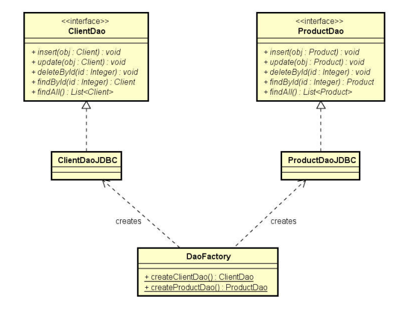

# SQL_Demo-projeto-DAO
Padrão de projeto DAO (Data Access Object)

### Referências:
https://www.devmedia.com.br/dao-pattern-persistencia-de-dados-utilizando-o-padrao-dao/30999
https://www.oracle.com/technetwork/java/dataaccessobject-138824.html

### Ideia geral do padrão DAO:
```txt
* Para cada entidade, haverá um objeto responsável por fazer acesso a dados relacionado a esta
entidade. Por exemplo:
          o Cliente: ClienteDao
          o Produto: ProdutoDao
          o Pedido: PedidoDao
          
* Cada DAO será definido por uma interface.

* A injeção de dependência pode ser feita por meio do padrão de projeto Factory
```

<p align="center">
    
</p>
